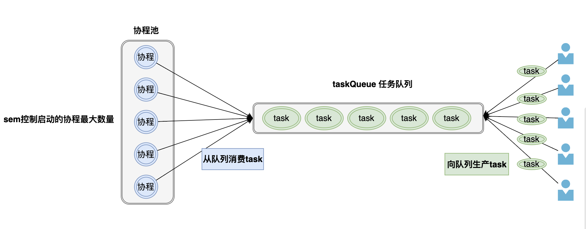

# 超简版协程池

**代码只有70行**，如果讨厌乱七八糟的封装和故弄玄虚，这个很适合你，学费它




## 直接贴代码

```go
package tinygpool

import (
	"errors"
	"time"
)

var (
	ErrExecTimeOut = errors.New("exec time out")
)

type Pool struct {
	sem       chan struct{} // 最多启动的协程数量 > 0
	taskQueue chan func()   // 任务队列 >= 0
}

func NewPool(capacity int, queueSize int) *Pool {

	if capacity <= 0 || queueSize < 0 {
		panic("capacity or queueSize is invalid")
	}
	p := Pool{
		sem:       make(chan struct{}, capacity),
		taskQueue: make(chan func(), queueSize),
	}

	// taskQueueu如果有缓冲的话，就立刻启动一个协程（等待taskQueue中的任务）
	if queueSize > 0 {
		p.sem <- struct{}{}
		go p.goWorker(func() {})
	}

	return &p
}

func (p *Pool) Exec(task func()) {
	p.exec(task, nil)
}

func (p *Pool) ExecTimeout(task func(), duration time.Duration) error {
	return p.exec(task, time.After(duration))
}

func (p *Pool) exec(task func(), timeout <-chan time.Time) error {
	select {
	case p.taskQueue <- task: // 说明 taskQueue还未满，可以正常接收任务
		return nil
	case p.sem <- struct{}{}: // 这里说明taskQueue已经满了（也就是任务很多，启动的协程有点少），那就启动新协程，加快任务的消耗
		go p.goWorker(task)
	case <-timeout: // 这里说明:任务队列满了 and 启动的协程数量达到了最大，不能处理更多任务了，那就返回错误信息
		return ErrExecTimeOut
	}
	return nil
}

func (p *Pool) goWorker(task func()) {

	defer func() {
		<-p.sem
	}()

	// 执行任务
	task()

	// 监听更多的任务
	for task := range p.taskQueue {
		task()
	}
}


```